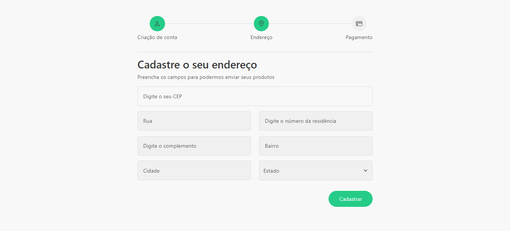

<h1 align="center">
  Autocompletar endereço a partir do CEP
</h1>

  

## Projeto - Autocompletar endereço a partir do CEP

Este projeto oferece uma experiência aos usuários o preenchimento automático do endereço através do CEP, utilizando a API gratuita do viaCEP. Com um design atraente e adaptação responsiva, garantimos funcionalidade em variados dispositivos.

Tecnologias Utilizadas:
* [HTML (Linguagem de marcação):](https://www.w3schools.com/html/html_intro.asp) Utilizado para estruturar e definir o conteúdo da página, incluindo cabeçalhos, parágrafos, listas e imagens.
* [CSS (Folha de estilos em cascata):](https://www.w3schools.com/css/css_intro.asp) Utilizado para estilizar os elementos da página, definindo cores, tamanhos, fontes e layout, proporcionando uma aparência visualmente atraente.
* [JavaScript:](https://developer.mozilla.org/pt-BR/docs/Web/JavaScript) Utilizado para adicionar interatividade à página, permitindo que o usuário selecione personagens e exiba informações dinamicamente.
* [Bootstrap:](https://getbootstrap.com/) É um framework front-end que oferece uma biblioteca de componentes e estilos prontos para facilitar o desenvolvimento de interfaces web responsivas e consistentes.
* [Bootstrap Icons:](https://icons.getbootstrap.com/) É uma biblioteca de ícones vetoriais, simples de usar e personalizável, projetada para complementar o Bootstrap, oferecendo uma variedade de símbolos prontos para uso em interfaces web responsivas.
* [viaCEP:](https://viacep.com.br/) API do viaCEP é um serviço gratuito que fornece informações de CEP no Brasil, permitindo a busca e obtenção de dados de endereço a partir do código postal, facilitando integrações em aplicativos e sistemas para localização geográfica.
* [TinyJPG](https://tinyjpg.com/) e [TinyPNG:](https://tinypng.com/) O site utilizado é uma ferramenta online que comprime imagens JPEG e PNG sem perder muita qualidade. Ele reduz o tamanho dos arquivos de imagem usando algoritmos eficientes de compressão.

Créditos:
* Criado com base do Canal no YouTube | [Matheus Battisti - Hora de Codar](https://www.youtube.com/@MatheusBattisti)

Implantação do Projeto no Netlify: [Explore o projeto clicando aqui.](https://app-autocompletar-endereco-cep.netlify.app/)

---

## Project - Autocomplete address from postal code

This project offers users the experience of automatically filling in their address by zip code, using the free viaCEP API. With an attractive design and responsive adaptation, we guarantee functionality on a variety of devices.

Technologies used: 
* [HTML (Linguagem de marcação):](https://www.w3schools.com/html/html_intro.asp) Used to structure and define the content of the page, including headings, paragraphs, lists and images.
* [CSS (Folha de estilos em cascata):](https://www.w3schools.com/css/css_intro.asp) Used to style the elements of the page, defining colors, sizes, fonts and layout, providing a visually appealing appearance.
* [JavaScript:](https://developer.mozilla.org/pt-BR/docs/Web/JavaScript) Used to add interactivity to the page, allowing the user to select characters and display information dynamically.
* [Bootstrap:](https://getbootstrap.com/) It is a front-end framework that offers a library of ready-made components and styles to facilitate the development of responsive and consistent web interfaces.
* [Bootstrap Icons:](https://icons.getbootstrap.com/) It's a simple-to-use, customizable vector icon library designed to complement Bootstrap, offering a variety of symbols ready for use in responsive web interfaces.
* [viaCEP:](https://viacep.com.br/) viaCEP API is a free service that provides ZIP code information in Brazil, allowing you to search for and obtain address data from the postal code, facilitating integrations into applications and systems for geographic location.
* [TinyJPG](https://tinyjpg.com/) and [TinyPNG:](https://tinypng.com/) The website used is an online tool that compresses JPEG and PNG images without losing too much quality. It reduces 

Credits:
* Created on the basis of the YouTube Channel | [Matheus Battisti - Hora de Codar](https://www.youtube.com/@MatheusBattisti)

Project deployment on Netlify: [Explore the project by clicking here.](https://app-autocompletar-endereco-cep.netlify.app/)
